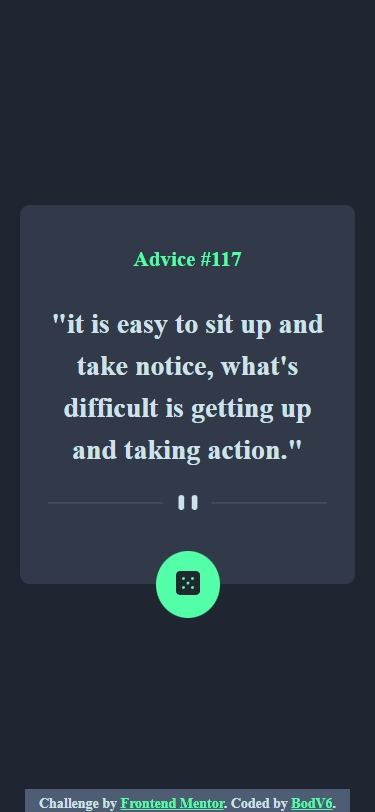
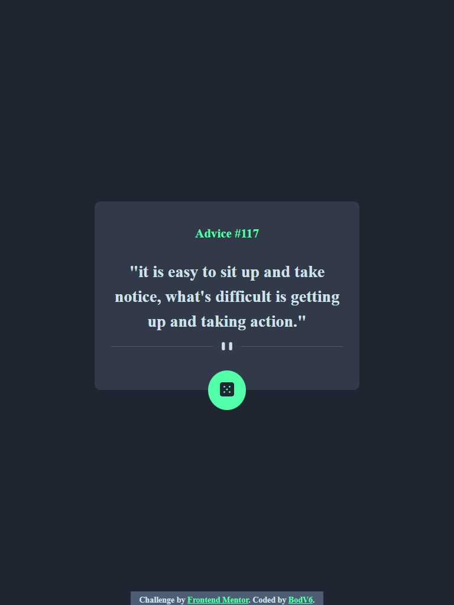
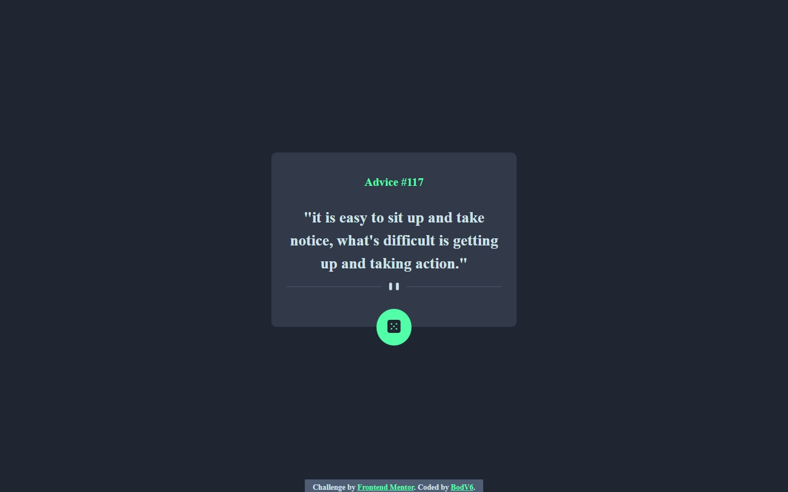

# Frontend Mentor - Advice generator app solution

This is a solution to the [Advice generator app challenge on Frontend Mentor](https://www.frontendmentor.io/challenges/advice-generator-app-QdUG-13db). Frontend Mentor challenges help you improve your coding skills by building realistic projects.

## Table of contents

- [Frontend Mentor - Advice generator app solution](#frontend-mentor---advice-generator-app-solution)
  - [Table of contents](#table-of-contents)
  - [Overview](#overview)
    - [The challenge](#the-challenge)
    - [Screenshot](#screenshot)
    - [Links](#links)
  - [My process](#my-process)
    - [Built with](#built-with)
    - [Useful resources](#useful-resources)
  - [Author](#author)
  - [Acknowledgments](#acknowledgments)

## Overview

### The challenge

Users should be able to:

- View the optimal layout for the app depending on their device's screen size
- See hover states for all interactive elements on the page
- Generate a new piece of advice by clicking the dice icon

### Screenshot

### Links

- Solution URL: [FrontEnd Mentor solution](https://www.frontendmentor.io/solutions/responsive-advice-generator-app-using-only-htmlcssjs-lJHPMcKY4X)
- Live Site URL: [Github page](https://bodv6.github.io/advice-generator-app/)

## My process

### Built with

- Semantic HTML5 markup
- CSS custom properties
- Flexbox
- Mobile-first workflow
- Vanilla javaScript

### Useful resources

- [geeksForgeeks](https://www.geeksforgeeks.org/how-to-use-the-javascript-fetch-api-to-get-data/) - This helped on how to use the JavaScript Fetch API to Get Data. I really liked this pattern and will use it going forward.

## Author

- Github - [@bodV6](https://github.com/bodV6)
- Frontend Mentor - [@bodV6](https://www.frontendmentor.io/profile/bodV6)
- Twitter - [@bodVr6](https://www.twitter.com/bodVr6)

## Acknowledgments

- Thanks to the [Frontend Mentor](https://www.frontendmentor.io) team for the free Challenges
